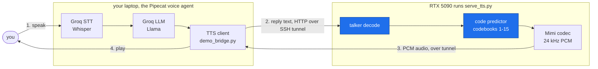
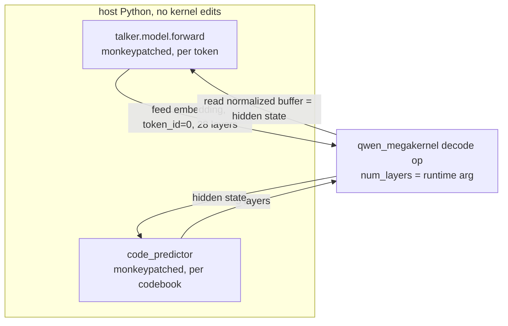

# qwen3tts-megakernel

Serving **Qwen3-TTS**'s talker decoder with AlpinDale's
[`qwen_megakernel`](https://github.com/AlpinDale/qwen_megakernel) (a persistent CUDA decode kernel
for the RTX 5090), streamed frame by frame into a **Pipecat** voice agent.

**TTFC 47 ms, RTF 0.108, cosine 0.9998, no kernel edits.**

**Watch the demo: [demo/demo.mp4](demo/demo.mp4)** -- the voice agent running end to end on the 5090.

## Architecture (end to end)

From your voice to audio out. You talk on your laptop; only the talker TTS runs on the 5090, reached
over an SSH tunnel, so the GPU box needs no mic, speaker, or even internet.



The blue stages, **talker** and **code predictor**, both run on the megakernel; the Mimi codec turns
their codes into 24 kHz audio. STT and the LLM run on the laptop (reliable network), so the box only
does the GPU work.

## Results

Measured live on an **RTX 5090** (bf16). Raw logs in [`logs/`](logs/), including `demo_serve.log`
from the recorded demo.

| metric | result | brief's targets | verdict |
|---|---|---|---|
| Talker decode vs PyTorch | **9.6x faster**, cosine **0.9998** | -- | bit-faithful (`logs/validate_codepred.txt`) |
| Megakernel decode rate | **~1031 tok/s** (0.97 ms/step) | -- | |
| **RTF** (batch synthesis) | **0.108** | < 0.3 / 0.15 / 0.1 | meets 0.3 and 0.15; ~at 0.1 (`logs/bench_rtf.txt`) |
| **TTFC** (time to first audio chunk) | **47 ms** | < 90 / 60 / 50 ms | meets all three (`logs/bench_ttfc.txt`) |
| Live demo (recorded) | **RTF 0.115-0.123** across 5 replies | -- | `logs/demo_serve.log` |
| Streaming | frame-by-frame, not buffered | required | yes |

It meets the targets. The brief states three tiers; RTF 0.108 clears the first two (< 0.3, < 0.15)
and sits a hair over only the strictest 0.1, while TTFC 47 ms clears all three. The megakernel makes
the talker LM pass about 21 ms, so our TTFC beats Qwen3-TTS's own official **97 ms** first-packet
latency by roughly 2x. cosine 0.9998, verified by ear.

Where the 47 ms TTFC goes (`logs/bench_ttfc.txt`):

| phase | ms | note |
|---|---|---|
| prefill | 20.3 | 21 prompt tokens, token-by-token through the single-token kernel at 0.97 ms/tok |
| first codec decode | 14.5 | one Mimi frame |
| code predictor (15 codebooks) | 6.6 | on the kernel, no-graph rollout |
| first talker frame | 1.0 | the megakernel doing its job |

## How the megakernel serves two models, with no kernel edits

Qwen3-TTS's talker is shape-identical to Qwen3-0.6B (28 layers), and its code predictor is the same
shape with 5 layers. The kernel takes `num_layers` as a runtime argument, so **one kernel drives
both**; the entire adaptation is host-side.



- **Talker to kernel.** The `decode` op writes the post-final-norm hidden into its `normalized`
  buffer before its lm_head reads it. So we feed the input *embedding* as `embed_weight` with
  `token_id=0`, ignore the op's output token, and read `normalized` = the hidden. Cosine **0.9998**
  vs the reference backbone (`bench/validate_codepred.py`).
- **Code predictor to the same kernel** with `num_layers=5`. It must be **sampled**, not
  greedy-decoded -- a single bf16 argmax flip cascades through its 15-way loop and the talker
  feedback, so greedy degenerates; under sampling both paths stay in-distribution and the audio is clean.
- **Swappable backend.** `DECODE_BACKEND=reference|megakernel` behind one interface
  (`decoders/base.py`), so the whole pipeline is built and debugged off-GPU and the kernel drops in
  via an env var.

## Quick start

Needs an **RTX 5090** (the kernel is sm_120 / Blackwell, CUDA 12.8+). The pipeline runs on any
GPU/CPU with `DECODE_BACKEND=reference`; only the kernel needs the 5090.

```bash
# 1. clone the kernel (unmodified) and let it JIT-build
git clone https://github.com/AlpinDale/qwen_megakernel /workspace/qwen_megakernel

# 2. install (the model downloads on first load; hf_transfer makes it ~20x faster)
pip install -r requirements.txt
export HF_HUB_ENABLE_HF_TRANSFER=1

# 3. validate + benchmark (these produce the logs in logs/)
export SKIP_CP_GRAPH=1                      # see the note below
python bench/validate_codepred.py           # megakernel reproduces the backbone, cosine 0.9998
python bench/bench_clean.py                 # batch RTF
python bench/ttfc_clean.py                  # TTFC + per-phase breakdown

# 4. voice demo  (cp .env.example .env, set GROQ_API_KEY)
python tts/demo.py                                 # local mic, reference backend
DECODE_BACKEND=megakernel python tts/demo.py       # 5090 + megakernel, local mic
```

> **`SKIP_CP_GRAPH=1` is the safe default.** The code predictor can run its 15-codebook rollout as a
> captured CUDA graph, but the capture corrupts CUDA state on some 5090 instances (generation never
> terminates -- see [Limitations](#limitations)). The no-graph kernel rollout is correct and measured
> faster, so disable the graph.

## Demo

A headless cloud 5090 has no mic or speaker, and its outbound network can block the WebRTC services
those demos usually need. So the voice pipeline runs on your laptop and only the talker TTS runs on
the 5090, over the SSH tunnel -- the layout in [Architecture](#architecture-end-to-end). Full steps in
[DEMO.md](DEMO.md).

The recorded run is **[demo/demo.mp4](demo/demo.mp4)** (click to play it on GitHub); each spoken
reply is a `[TTS] megakernel: ... RTF ...` line in [`logs/demo_serve.log`](logs/demo_serve.log)
(RTF 0.115-0.123).

## Performance

The megakernel makes the decode *step* fast; profiling showed the real cost was the **host-side
generation loop** around it (GPU about 4 percent busy at first). Highlights:

- **About 1 s of host waste removed** -- a transformers logits processor was recomputing a *constant*
  suppress mask every step (now cached), plus a benchmark hook forcing a per-frame sync.
- **RTF 0.108** -- code predictor on the kernel (no-graph rollout), suppress mask cached, no per-frame
  sync. The per-frame cost (about 1.0 talker + 6.6 cp ms) times 55 frames + codec matches the 475 ms
  total, so RTF and the TTFC breakdown corroborate each other.
- **TTFC 47 ms** -- the bottleneck is **prefill** (20 ms): the megakernel is single-token, so an
  N-token prompt is N sequential launches. A batched prefill would cut it toward a few ms.
- **The CP CUDA graph is fragile** -- capturing the rollout as a CUDA graph corrupts state on some
  5090 instances (generation runs away). The no-graph kernel rollout (`SKIP_CP_GRAPH=1`) is correct
  and faster here (0.108 vs the 0.281 the graph path gave on an earlier instance).
- **The megakernel is the right tool for both loops** (measured): native eager PyTorch is 2.7x
  slower, and `torch.compile` + StaticCache is 92x slower (recompiles every step).

## Layout

| path | what |
|---|---|
| `decoders/` | swappable decode interface + both backends -- `megakernel.py` (5090) and `reference.py` |
| `tts/` | Mimi codec decode, the Pipecat TTS service, `demo.py`, and the headless bridge (`serve_tts.py` + `demo_bridge.py`) |
| `bench/` | kernel validation, RTF (`bench_clean.py`), TTFC (`ttfc_clean.py`), cp A/B, diagnostic |
| `samples/` | A/B audio: megakernel vs PyTorch |
| `logs/` | live RTX 5090 logs: `gpu.txt`, cosine, RTF, TTFC, `demo_serve.log` |
| `demo/` | the recorded demo video |

## Limitations

Honest about what is rough:

- **RTF 0.108 is a hair over the strictest 0.1 target** (it meets < 0.15 and < 0.3). The remaining
  cost is prefill + codec, both addressable (batched prefill, stateful codec).
- **The CP CUDA graph corrupts state on some 5090 instances** -- use `SKIP_CP_GRAPH=1` (the no-graph
  kernel rollout), the safe default and also faster.
- **`stream()` re-decodes the growing prefix, which is O(n^2)**, instead of the codec's native
  stateful `chunked_decode`. The demo and headline numbers use **batch synthesize** (one codec
  decode), not this path; a stateful Mimi decoder would make true frame-by-frame streaming cheap too.
- The code predictor must be **sampled, not greedy** -- a bf16 argmax flip cascades through its
  15-way autoregressive loop (see the [megakernel section](#how-the-megakernel-serves-two-models-with-no-kernel-edits)).
